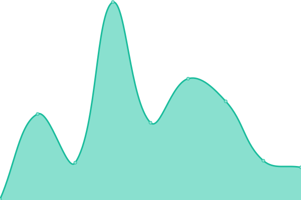
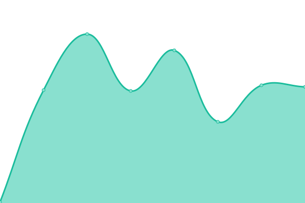
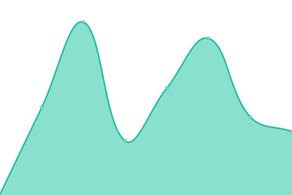

# [📈 Live Status](https://uptime.quanghd.me): <!--live status--> **🟩 All systems operational**

This repository contains the open-source uptime monitor and status page for [QuangHD](https://uptime.quanghd.me), powered by [Upptime](https://github.com/upptime/upptime).

With [Upptime](https://upptime.js.org), you can get your own unlimited and free uptime monitor and status page, powered entirely by a GitHub repository. We use [Issues](https://github.com/QuangHD/upptime/issues) as incident reports, [Actions](https://github.com/QuangHD/upptime/actions) as uptime monitors, and [Pages](https://uptime.quanghd.me) for the status page.

<!--start: status pages-->
<!-- This summary is generated by Upptime (https://github.com/upptime/upptime) -->
<!-- Do not edit this manually, your changes will be overwritten -->
<!-- prettier-ignore -->
| URL | Status | History | Response Time | Uptime |
| --- | ------ | ------- | ------------- | ------ |
|  [QuangHD's website](https://quanghd.me) | 🟩 Up | [quang-hd-s-website.yml](https://github.com/quanghd0102/upptime/commits/HEAD/history/quang-hd-s-website.yml) | 

 244ms
     
 | 

<a href="https://uptime.quanghd.me/history/quang-hd-s-website">100.00%</a>
    

|  [Tiến lên ghi điểm](http://tienlen-ghidiem.quanghd.me) | 🟩 Up | [tien-len-ghi-diem.yml](https://github.com/quanghd0102/upptime/commits/HEAD/history/tien-len-ghi-diem.yml) | 

 238ms
     
 | 

<a href="https://uptime.quanghd.me/history/tien-len-ghi-diem">100.00%</a>
    

|  [QuangHD's blog](https://blog.quanghd.me) | 🟩 Up | [quang-hd-s-blog.yml](https://github.com/quanghd0102/upptime/commits/HEAD/history/quang-hd-s-blog.yml) | 

 190ms
     
 | 

<a href="https://uptime.quanghd.me/history/quang-hd-s-blog">100.00%</a>
    

|  [QuangHD's donation website](https://donate.quanghd.me) | 🟩 Up | [quang-hd-s-donation-website.yml](https://github.com/quanghd0102/upptime/commits/HEAD/history/quang-hd-s-donation-website.yml) | 

 294ms
     
 | 

<a href="https://uptime.quanghd.me/history/quang-hd-s-donation-website">100.00%</a>
    

<!--end: status pages-->

[**Visit our status website →**](https://uptime.quanghd.me)

## 📄 License

- Powered by: [Upptime](https://github.com/upptime/upptime)
- Code: [MIT](./LICENSE) © [QuangHD](https://uptime.quanghd.me)
- Data in the `./history` directory: [Open Database License](https://opendatacommons.org/licenses/odbl/1-0/)
